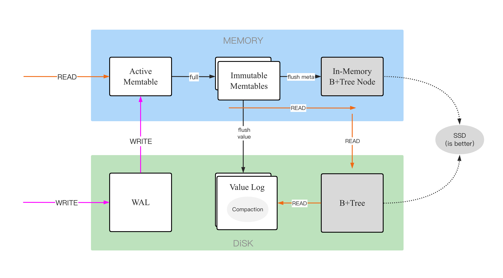

egoDB is a fast k/v database compatible with LSM tree and B+ tree.

Key features:

* **Implementing LLVR for CodeGen to optimize query execution(to be finished)**
* **Merging the LSM and B+ tree for high read/write performance**
* **Get rid of the redundancy of SSTable**
* **Much lower read and space amplification than typical LSM**

## Design Overview
egoDB is inspired by a paper named [SLM-DB](https://www.usenix.org/conference/fast19/presentation/kaiyrakhmet) in USENIX FAST ’19, and the [Wisckey](https://www.usenix.org/system/files/conference/fast16/fast16-papers-lu.pdf) paper also helps a lot.

## Quick Start

**embedded usage:** see [examples](examples).

## License
egoDB is under the Apache 2.0 license.

